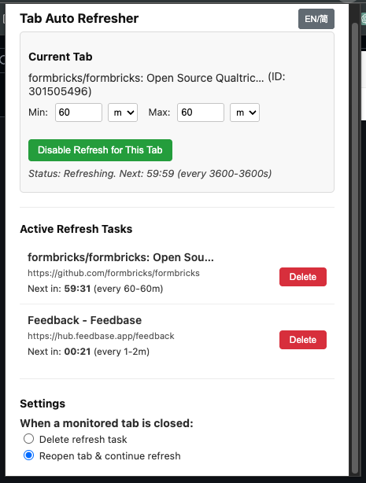

# Tab Auto Refresh 浏览器插件

一个极简的浏览器插件，可为指定标签页定时随机刷新，刷新时间可自定义范围。

## 截图预览

## 功能简介
- 针对当前标签页定时刷新
- 刷新间隔可设置为某个范围内的随机秒数
- 一键开始/停止刷新
- 支持中英双语快速切换

## 使用方法
1. 克隆本仓库或下载全部文件到本地。
2. 打开 Chrome 浏览器，进入 `扩展程序` 页面（chrome://extensions/）。
3. 开启“开发者模式”，点击“加载已解压的扩展程序”，选择本项目文件夹。
4. 点击浏览器右上角插件图标，设置最小/最大刷新间隔（单位：秒），点击“开始刷新”。
5. 如需停止，点击“停止刷新”即可。

## 文件说明
- `manifest.json`：插件声明文件
- `popup.html`：插件弹窗界面
- `popup.js`：弹窗逻辑，负责与后台通信
- `background.js`：后台脚本，负责定时刷新标签页

## 许可协议
MIT 